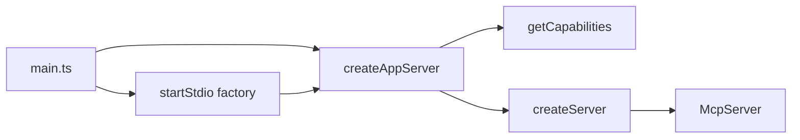

# MCP class-based starter

This repo is a **copyable starter**, not a reusable npm framework. Duplicate it into real MCP server projects. Keep names generic, the core thin, and the sample capabilities obvious to replace.

Official SDK for the 2026-07-28 spec: [`@modelcontextprotocol/server`](https://www.npmjs.com/package/@modelcontextprotocol/server) v2 (`McpServer`, `serveStdio`, Zod 4). Do not use v1 `@modelcontextprotocol/sdk`.

## Layout

All app code under `src/`:

```
src/
  main.ts
  capabilities/
    capabilities.ts
  core/
    types.ts
    create-server.ts
    register-capabilities.ts
    map-results.ts
    capabilities.types.spec.ts
    transports/
      stdio.ts
  tools/
    add-tool/
      add-tool.ts
      add-tool.schemas.ts
      add-tool.types.ts
      add-tool.spec.ts
  resources/
    project-info/
      project-info.ts
      project-info.schemas.ts
      project-info.types.ts
      project-info.spec.ts
  prompts/
    code-review/
      code-review.ts
      code-review.schemas.ts
      code-review.types.ts
      code-review.spec.ts
  utils/
    logger.ts
```

- `src/main.ts` - shebang + server factory + `startStdio(createAppServer)`. Slim, not a line-count target. Lifecycle (handle + signals) lives in the stdio transport.
- `src/capabilities/capabilities.ts` - returns arrays of class instances
- `src/core/` - interfaces, registration, result mapping, transport
- `src/core/capabilities.types.spec.ts` - type-level proof that two differently typed tools can live in one `Capabilities` list
- sample capability files follow `*.ts`, `*.schemas.ts`, `*.types.ts`, `*.spec.ts`

## Core contract

Handlers return domain values by default. Core maps those to MCP wire format. Core never calls `.parse()` on input or output schemas. The SDK owns schema application.

Parameterize each contract with the Zod schema itself, not a pre-inferred `ZodType<T>`. Handler arguments are the schema **output** type (`z.output<...>`), because the SDK has already parsed.

### Request extra

SDK v2 handlers receive a second argument: a request context. Progress, cancellation, MCP logging, and later auth/elicitation live on `ctx.mcpReq` (`signal`, `notify`, `log`, `_meta`). Do not invent a parallel context type.

Alias the SDK's second-argument type in `src/core/types.ts` as `McpRequestExtra` (whatever `registerTool` / `registerResource` / `registerPrompt` actually export; likely a context object with `mcpReq`). Registration wrappers must forward that object unchanged.

The extra parameter is **optional** on every handler. Samples omit it. A later tool can use `extra.mcpReq.signal` or `extra.mcpReq.notify` without changing core.

### Handler results: domain default, wire pass-through

Keep domain returns as the starter path. Also accept already-built SDK results so a capability can return mixed content, mixed prompt roles, or extra wire fields without rewriting `map-results.ts`.

Import the SDK result types (`CallToolResult`, prompt `{ messages }`, resource `{ contents }`) and union them with the domain return. Core uses type guards:

- **Tool:** if the value looks like `CallToolResult` (`content` is an array of content blocks), return it as-is. Otherwise wrap as `{ content: [{ type: "text", text: JSON.stringify(output) }], structuredContent: output }`.
- **Resource:** if the value looks like `{ contents: [...] }`, return it as-is. Otherwise apply the resource serialization contract below.
- **Prompt:** if the value is `{ messages: [...] }`, return it as-is. If it is a string, wrap as one text message using `role` (default `"user"`).

Thrown errors still become `{ isError: true, content: [...] }` for tools. Wire pass-through is not a second mapper; it is a skip.

Known limitation: a tool whose **structured** output itself has a `content` array of blocks would be treated as wire format. Starter schemas will not do that. Do not add a branded helper in this starter.

```ts
type JsonPrimitive = string | number | boolean | null;
type JsonObject = { readonly [key: string]: JsonValue };
type JsonArray = readonly JsonValue[];
type JsonValue = JsonPrimitive | JsonObject | JsonArray;

type ToolHandlerResult<TOutput> = TOutput | CallToolResult;
type ResourceHandlerResult<T extends JsonValue = JsonValue> =
  | T
  | { contents: ResourceContents[] };
type PromptHandlerResult = string | { messages: PromptMessage[] };

interface McpTool<
  TInputSchema extends z.ZodType = z.ZodType,
  TOutputSchema extends z.ZodType = z.ZodType,
> {
  name: string;
  description: string;
  inputSchema: TInputSchema;
  outputSchema: TOutputSchema;
  handler(
    input: z.output<TInputSchema>,
    extra?: McpRequestExtra,
  ):
    | ToolHandlerResult<z.output<TOutputSchema>>
    | Promise<ToolHandlerResult<z.output<TOutputSchema>>>;
}

interface McpResource<T extends JsonValue = JsonValue> {
  uri: string;
  name: string;
  description: string;
  /** Listing hint for `resources/list` only. Contents MIME is derived from the handler value. */
  mimeType?: string;
  handler(
    uri: string,
    extra?: McpRequestExtra,
  ): ResourceHandlerResult<T> | Promise<ResourceHandlerResult<T>>;
}

interface McpPrompt<TArgsSchema extends z.ZodType = z.ZodType> {
  name: string;
  description: string;
  argsSchema: TArgsSchema;
  /** Default for the string-return shortcut only. Ignored when handler returns `{ messages }`. */
  role?: "user" | "assistant";
  handler(
    args: z.output<TArgsSchema>,
    extra?: McpRequestExtra,
  ): PromptHandlerResult | Promise<PromptHandlerResult>;
}
```

`role` is not a prompt-wide constraint. MCP prompts can mix `user` / `assistant` messages and content types (`text`, `image`, `audio`, `resource`, `resource_link`). The string + `role` path is only the starter shortcut. `CodeReviewPrompt` still returns a string.

Starter schemas are transform-free objects (`z.object({ ... })`). `z.input` and `z.output` then match. If a later tool needs `.transform()`, that transform must run only in the SDK (the schema passed to `registerTool` / `registerPrompt`). Core still must not parse.

### Schema ownership

| Value | Who parses | Core does |
| --- | --- | --- |
| Tool input | SDK (`inputSchema` on `registerTool`) | Call `handler(args, extra)` with already-parsed args and forwarded extra |
| Tool output | SDK (`outputSchema` on `registerTool`) | Wrap domain return, or pass through `CallToolResult`; do not `.parse()` |
| Prompt args | SDK (`argsSchema` on `registerPrompt`) | Call `handler(args, extra)` with already-parsed args and forwarded extra |
| Resource body | none | Wrap domain return with the serialization contract, or pass through `{ contents }` |

`src/core/create-server.ts` is transport-agnostic: `new McpServer({ name, version })`, then `registerTool` / `registerResource` / `registerPrompt`. Each SDK callback must pass `extra` through:

```ts
server.registerTool(tool.name, { description, inputSchema, outputSchema }, (args, extra) =>
  mapToolResult(await tool.handler(args, extra)),
);
```

Do not add a human-readable text formatter in this starter. If a later tool wants prose or mixed blocks in `content`, return a `CallToolResult` from that tool. The generic domain default is always serialized JSON of the structured output, so `content` and `structuredContent` agree.

### Resource serialization

`JSON.stringify` is not a resource contract: top-level `undefined`, functions, and symbols return `undefined`; `bigint` and circular objects throw; `NaN` / `Infinity` become `null`; `Date` becomes a string. Domain resource results are therefore **strings or JSON values only**. Binary / blob payloads use wire `{ contents }` with `blob`, not the domain path.

JSON value (narrower than `unknown`):

```ts
function isJsonValue(value: unknown): value is JsonValue {
  if (value === null) return true;
  const valueType = typeof value;
  if (valueType === "string" || valueType === "boolean") return true;
  if (valueType === "number") return Number.isFinite(value);
  if (valueType !== "object") return false;
  if (Array.isArray(value)) return value.every(isJsonValue);
  const prototype = Object.getPrototypeOf(value);
  if (prototype !== Object.prototype && prototype !== null) return false;
  return Object.values(value).every(isJsonValue);
}
```

Domain wrap in `mapResourceResult(uri, value)`. Check **in this order**: wire `{ contents }` first (a contents object is also a JSON object, so `isJsonValue` would otherwise stringify it), then `string`, then other JSON values.

| Handler return | Contents `mimeType` | Contents `text` |
| --- | --- | --- |
| `{ contents: [...] }` | unchanged | pass through; handler owns MIME |
| `string` | `text/plain` | the string as-is (not JSON-quoted) |
| other `JsonValue` | `application/json` | `JSON.stringify(value)` |

Class-level `mimeType` is only the `resources/list` advertisement. Contents MIME always follows the table above, even if listing and contents disagree. Sample `project://info` returns a string, so listing `mimeType` is `"text/plain"` to match.

Serialization failure: throw `ResourceSerializationError` (extends `Error`). Do not emit a resource body with empty `text`. Cases:

- `undefined`, functions, symbols, `bigint`
- `NaN`, `Infinity`, `-Infinity`
- `Date`, `Map`, `Set`, `Buffer`, class instances, objects with a non-plain prototype
- circular references
- `JSON.stringify` returning `undefined` or throwing

Resources have no tool-style `isError`. Registration must not catch this into fake contents. Log with `logger.error({ err }, "resource serialization failed")`, then rethrow so `resources/read` fails as a protocol error.

Mapper tests cover: string -> `text/plain`; object / array / number / boolean / `null` -> `application/json`; `undefined` / circular / `Date` / `NaN` throw; wire `{ contents }` is unchanged.

## Heterogeneous capability collections

Each class keeps its specific schema types (`implements McpTool<typeof AddToolInputSchema, typeof AddToolOutputSchema>`). Arrays cannot stay fully generic under `strictFunctionTypes`: `McpTool<SchemaA, OutA>` is not assignable to `McpTool<SchemaB, OutB>`.

Erase at the collection boundary only. Use **method syntax** on the erased handler so parameters stay bivariant:

```ts
interface AnyMcpTool {
  readonly name: string;
  readonly description: string;
  readonly inputSchema: z.ZodType;
  readonly outputSchema: z.ZodType;
  handler(input: unknown, extra?: McpRequestExtra): unknown | Promise<unknown>;
}

interface AnyMcpPrompt {
  readonly name: string;
  readonly description: string;
  readonly argsSchema: z.ZodType;
  readonly role?: "user" | "assistant";
  handler(
    args: unknown,
    extra?: McpRequestExtra,
  ): PromptHandlerResult | Promise<PromptHandlerResult>;
}

interface AnyMcpResource {
  readonly uri: string;
  readonly name: string;
  readonly description: string;
  readonly mimeType?: string;
  handler(uri: string, extra?: McpRequestExtra): unknown | Promise<unknown>;
}

interface Capabilities {
  tools: readonly AnyMcpTool[];
  prompts: readonly AnyMcpPrompt[];
  resources: readonly AnyMcpResource[];
}
```

`getCapabilities()` returns `Capabilities`. Classes stay specifically typed. Registration iterates the erased arrays and passes each schema through to the SDK.

Prove this with a type-only test in `src/core/capabilities.types.spec.ts`: two tool classes with different input/output schemas must be assignable to `Capabilities["tools"]`. The second tool exists only in that test. Runtime still ships one tool, one resource, one prompt.

## Server factory (stdio and later HTTP)

`serveStdio` takes a **server factory**, not a live `McpServer`. The SDK may call the factory more than once during protocol negotiation. Each call must get fresh capability instances.

```ts
const createAppServer = () => createServer(getCapabilities());

startStdio(createAppServer);
```

`getCapabilities()` runs **inside** the factory, not at module load.

`src/core/transports/stdio.ts` wraps `serveStdio` from `@modelcontextprotocol/server/stdio`. `serveStdio` returns a `StdioServerHandle`. Capture it. `close()` tears down the pinned server instance and the transport.

Do not drop shutdown to keep `main.ts` short. Register `SIGINT` and `SIGTERM` in the stdio transport so every caller of `startStdio` gets the same lifecycle. `main.ts` still only defines `createAppServer` and calls `startStdio`. The factory is the later HTTP seam: the same `createAppServer` can be passed to Streamable HTTP without changing tools, prompts, or resources. Do not add a throwing `http.ts` stub; dead code is not a seam.

```ts
export function startStdio(createServer: () => McpServer): StdioServerHandle {
  const handle = serveStdio(createServer, {
    onerror: (error) => {
      logger.error({ err: error }, "stdio transport error");
    },
  });

  const shutdown = (signal: NodeJS.Signals) => {
    logger.info({ signal }, "stdio shutting down");
    void handle
      .close()
      .catch((error: unknown) => {
        logger.error({ err: error }, "stdio shutdown failed");
        process.exitCode = 1;
      })
      .finally(() => {
        process.exit();
      });
  };

  process.once("SIGINT", shutdown);
  process.once("SIGTERM", shutdown);

  return handle;
}
```

Shutdown rules:

- Hosts usually close stdin and wait for the process to exit. Signals still fire when Cursor/IDE stops the server. Handle both by closing the SDK handle.
- `process.once` so a second signal does not start a second `close()`.
- After `close()` settles, `process.exit()`. Closing the transport does not always end the process if stdin stays open.
- Log shutdown to stderr via pino. Never write to stdout.
- Return the handle so tests can close without killing the process. Signal handlers still call `process.exit()`.

`src/capabilities/capabilities.ts`:

```ts
export function getCapabilities(): Capabilities {
  return {
    tools: [new AddTool()],
    prompts: [new CodeReviewPrompt()],
    resources: [new ProjectInfoResource()],
  };
}
```

## Samples (easy to delete when copying)

- **Tool `add`:** `{ a, b }` numbers, returns `{ result: number }`. Text content is `JSON.stringify` of that object, e.g. `{"result":3}`. Handler does not take `extra`.
- **Resource `project://info`:** static project blurb as a **string**. Listing and contents MIME are `text/plain`. A later JSON resource returns a plain object and gets `application/json` from the mapper.
- **Prompt `code_review`:** `{ code: string }`, optional `role: "user"`, returns the review instruction **string**. Core wraps it as one user text message. Mixed-role / image prompts are allowed by the contract; this sample does not use them.

## Logger (pino)

Use **pino**, not `console.error` wrappers.

MCP stdio uses stdout for JSON-RPC. Pino defaults to stdout, which would break the protocol. Always write logs to **stderr**:

```ts
import pino from "pino";

export const logger = pino(
  {
    name: "mcp-framework",
    level: process.env.LOG_LEVEL ?? "info",
  },
  pino.destination(2),
);
```

Rules:

- Destination is fd `2` (stderr) in every environment, including later HTTP.
- No `pino-pretty` in this starter. JSON logs only.
- Level from `LOG_LEVEL` (`fatal` | `error` | `warn` | `info` | `debug` | `trace`), default `info`.
- Never `console.log` / `console.error`. Errors go through pino's `err` key so the default serializer keeps `type`, `message`, and `stack`: `logger.error({ err: error }, "stdio transport error")`. Do not pass the error as the first argument (`logger.error(error, msg)`).
- Log at **boundaries and failures** only: stdio `onerror`, shutdown, resource serialization failure, thrown tool handlers in the mapper. One `logger.info` when stdio starts is enough.
- Sample handlers (`AddTool`, `ProjectInfoResource`, `CodeReviewPrompt`) do not log. They are pure. Do not log every invocation in core or samples.

## Transport now vs later



- **Now:** `src/core/transports/stdio.ts` using `serveStdio` from `@modelcontextprotocol/server/stdio`. No `http.ts` file.
- **Later:** add Streamable HTTP with `@modelcontextprotocol/node` by passing the same `createAppServer` factory. Auth runs **before** the MCP handler (middleware / `createMcpExpressApp` hooks), not as a naive "is `Authorization` present?" check inside the transport. MCP HTTP is an OAuth 2.1 resource server: validate the bearer token (issuer, audience, expiry, scopes), then call `transport.handleRequest`. Reject with `401` / `403` before any JSON-RPC. Stdio keeps taking credentials from the environment, not this flow.

## Tooling

- **TypeScript** ESM, `strict`, `module` / `moduleResolution` `NodeNext`, `types: ["node"]` (required by SDK v2).
- Specs are co-located (`*.spec.ts`). Do not emit them into `dist/`. Use two configs:
  - `tsconfig.json`: include all of `src/` (app + specs) for the editor and Vitest.
  - `tsconfig.build.json`: extends `tsconfig.json`, `exclude` `**/*.spec.ts` (and `node_modules`, `dist`). `noEmit` false, `outDir` `dist`, `rootDir` `src`.
- `build` is `tsc -p tsconfig.build.json`. Never `tsc -p tsconfig.json` for the published/runnable output. After build, `dist/` must not contain `*.spec.js`.
- **Zod 4** (`zod` / `zod/v4`) for all input, output, and prompt args. Types via `z.output` / `z.infer` from the schema constants.
- **Biome** for lint + format. No ESLint/Prettier.
- **Vitest** for `*.spec.ts` (handler + schema tests; core mapper tests for domain wrap, wire pass-through, and resource serialization success/failure; one type-level capabilities test). Extra is optional, so a one-argument handler still assigns to `AnyMcpTool` via method-syntax bivariance. Vitest uses `tsconfig.json`, not the build config. No automated live Cursor/MCP integration test.
- **Node 20+**. Scripts: `build` (`tsc -p tsconfig.build.json`), `dev` (`tsx src/main.ts`), `start` (`node dist/main.js`), `lint`, `format`, `test`.
- Package name stays `mcp-framework` to match the folder. `bin` points at `dist/main.js`. README says: when you copy this, rename `package.json` `name`, `bin`, and the `McpServer` name.

Cursor stdio config (local starter):

```json
{
  "mcpServers": {
    "mcp-framework": {
      "command": "node",
      "args": ["/Users/hadi/repos/mcp-framework/dist/main.js"]
    }
  }
}
```

`npx` works after `npm run build` via the `bin` field. Cursor is more reliable with `node dist/main.js`.

Manual smoke test after `npm run build`:

```sh
npx @modelcontextprotocol/inspector node dist/main.js
```

Connect in the Inspector UI and exercise the three samples: tool `add`, resource `project://info`, prompt `code_review`. Do not add Inspector as a project dependency.

Short README only: copy/rename, add a capability, build, paste Cursor config, Inspector command. No extra docs.

## Out of scope

- HTTP transport and OAuth (no throwing stub; implement for real when needed)
- Checking only that an `Authorization` header exists (when HTTP is added, validate the token before the MCP handler)
- Publishing to npm
- Cookiecutter/CLI generator
- Extra runtime tools, resources, or prompts (a second tool is type-test only)
- Pretty-printed logs
- Human-readable tool text formatters
- Sample usage of cancellation, progress, MCP logging, auth context, or elicitation (the extra argument is the hook; samples leave it unused)
- Implementing mixed-content prompts or tools in the starter (the result union is the hook)
- Domain wrapping of binary / blob resources (use wire `{ contents }` with `blob`)
- Letting class-level `mimeType` override contents MIME on the domain path
- Windows `SIGBREAK` / `beforeExit` handlers (POSIX `SIGINT` / `SIGTERM` only)
