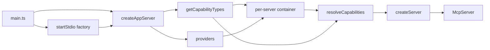

# MCP class-based starter

This repo is a **copyable starter**, not a reusable npm framework. Duplicate it into real MCP server projects. Keep names generic, the core thin, and the sample capabilities obvious to replace. Normal application development must not require edits inside `src/core/`: developers add capabilities through `src/capabilities/capabilities.ts`, add services and custom bindings through `src/providers.ts`, and edit core only when intentionally changing framework behavior.

Official SDK for the 2026-07-28 spec: [`@modelcontextprotocol/server`](https://www.npmjs.com/package/@modelcontextprotocol/server) v2 (`McpServer`, `serveStdio`, Zod 4). Do not use v1 `@modelcontextprotocol/sdk`.

## Layout

All app code under `src/`:

```
src/
  main.ts
  config.ts
  providers.ts
  capabilities/
    capabilities.ts
  core/
    types/
      index.ts
      capability.types.ts
      handler.types.ts
      json.types.ts
      server.types.ts
      tool.types.ts
    decorators/
      index.ts
      decorators.types.ts
      tool.decorator.ts
    capability-metadata.ts
    container.ts
    resolve-capabilities.ts
    create-server.ts
    register-capabilities.ts
    map-results.ts
    capabilities.types.spec.ts
    transports/
      stdio.ts
  services/
    calculator-service.ts
    calculator-service.spec.ts
  tools/
    add-tool/
      add-tool.ts
      add-tool.schemas.ts
      add-tool.types.ts
      add-tool.spec.ts
  resources/
    project-info/
      project-info.ts
      project-info.schemas.ts
      project-info.types.ts
      project-info.spec.ts
  prompts/
    code-review/
      code-review.ts
      code-review.schemas.ts
      code-review.types.ts
      code-review.spec.ts
  utils/
    logger.ts
```

- `src/main.ts` - shebang + per-server composition factory + `startStdio(createAppServer)`. Slim, not a line-count target. Lifecycle (handle + signals) lives in the stdio transport.
- `src/config.ts` - application-owned server identity (`name` and `version`) advertised to MCP clients, with defaults and optional environment overrides
- `src/providers.ts` - application-owned provider configuration; lists ordinary concrete services without requiring edits to generic core container code
- `src/capabilities/capabilities.ts` - returns explicit tool, prompt, and resource constructor lists from `getCapabilityTypes()`; it never constructs or discovers capabilities
- `src/core/container.ts` - creates one Inversify container per server, sets the default binding scope to singleton, binds provider configuration and listed capability classes, and permits explicit custom bindings without containing application service imports
- `src/core/types/` - barrel-exported type modules: JSON value contract, handler contracts and results, `@tool` metadata, capability composition, and server config
- `src/core/decorators/` - typed `@tool`, `@prompt`, and `@resource` metadata decorators plus metadata readers, one decorator per file over the shared `capability-metadata.ts` constructor store; each capability decorator also applies Inversify injectable metadata but never auto-registers classes
- `src/core/capability-metadata.ts` - shared constructor-metadata store used by every capability decorator: reads, writes, and the duplicate-capability guard
- `src/core/resolve-capabilities.ts` - resolves the listed constructors through the per-server container and combines each instance with its decorator metadata
- `src/core/` - handler contracts, decorators, resolution, registration, result mapping, and transport
- `src/core/capabilities.types.spec.ts` - type-level proof that heterogeneous decorated constructors share one `ICapabilities` list and mismatched schema-derived handlers fail compilation
- `src/services/calculator-service.ts` - small injectable sample dependency used by `AddTool`
- sample capability files follow `*.ts`, `*.schemas.ts`, `*.types.ts`, `*.spec.ts`

## Core contract

Handlers return domain values by default. Core maps those to MCP wire format. Core never calls `.parse()` on input or output schemas. The SDK owns schema application.

Capability classes implement non-generic `IMcpToolHandler`, `IMcpPromptHandler`, or `IMcpResourceHandler` contracts. Their method parameters and returns remain explicitly annotated with schema-derived types such as `AddToolInputType` and `AddToolOutputType`. The typed metadata decorators parameterize their internal target constraints with the Zod schema objects and verify that the decorated handler accepts `z.output<TSchema>` and returns the corresponding result contract. This keeps authoring concise without losing the schema-to-handler compile-time relationship.

Decorators do not add instance properties, replace constructors, resolve dependencies, scan modules, bind classes, or register classes globally. Metadata readers accept only the directly decorated constructor; metadata is not inherited implicitly. Each capability constructor must have exactly one of the three capability decorators. Before applying `injectable()`, every capability decorator checks one shared constructor-metadata store and throws a contextual decoration error if another capability decorator already marked the class. Pre-resolution validation rejects missing metadata, a constructor listed under the wrong capability kind, a duplicate tool or prompt name, or a duplicate resource URI.

Each project-owned `@tool`, `@prompt`, or `@resource` decorator composes Inversify's bare `injectable()` decorator internally. Capability authors apply only the capability decorator, which owns both MCP metadata and the minimum constructor metadata required for container resolution. The capability decorator must not select an Inversify scope; scope remains a container-binding decision. This removes repetitive `@injectable()` lines without introducing discovery or registration side effects. Service classes that are not capabilities still use Inversify's `@injectable()` directly. Do not combine `@injectable()` with a capability decorator on the same class; Inversify treats duplicate injectable decoration as a class-evaluation error. No decorator may replace the constructor.

### Dependency injection and lifetimes

Use constructor injection. Concrete classes are valid service identifiers and are the default for application-owned services with one implementation. Use symbol tokens only where an interface, multiple implementations, or a factory requires a runtime identifier. Capability code never imports the container or calls `container.get()`.

Create one Inversify container inside every `createAppServer()` invocation. The container's `defaultScope` is `"Singleton"`, so a normal binding is shared by all tools, prompts, and resources in that server. Because every server gets a new container, those singletons are isolated across server instances. Ordinary concrete service constructors live in the application-owned `src/providers.ts` list and are bound to themselves by generic container code. Developers add services to that list without editing `src/core/container.ts`.

The provider configuration also permits an optional application-owned custom binding function for cases that cannot be represented as a default self-binding, including symbol tokens, alternate implementations, constants, explicit transient scope, and factories. A service with a custom binding is omitted from the ordinary service list so it is bound exactly once. This keeps application-specific composition in `src/providers.ts` while keeping `src/core/container.ts` generic. Do not add an ambiguous `others` list unless a distinct binding behavior is defined.

The initial application configuration is intentionally small:

```ts
export const providers = {
  services: [CalculatorService],
} satisfies IProviderConfiguration;
```

`IProviderConfiguration` is exported by `src/core/container.ts`. It contains `services: readonly Newable<unknown>[]` and an optional `configure(container: Container): void` callback. `createAppContainer` binds `services` first, invokes `configure` second, and binds capability constructors last. The callback is absent from the starter runtime configuration and is exercised only by focused tests and documentation until an application needs a non-default binding.

A transient constructor dependency is new per capability resolution, not per MCP handler call. For a fresh dependency on every invocation, inject a factory function and bind it with Inversify `toFactory`; the factory resolves a transient service each time it is called. The starter documents and tests this provider pattern, but the runtime `AddTool` sample uses direct constructor injection because per-call calculators would be artificial.

```ts
type CalculatorFactory = () => CalculatorService;

container
  .bind(CalculatorService)
  .toSelf()
  .inTransientScope();

container
  .bind<CalculatorFactory>(SERVICE_TOKENS.CalculatorFactory)
  .toFactory((context: ResolutionContext) => {
    return () => context.get(CalculatorService);
  });
```

The container is a composition-root concern. Core MCP registration receives resolved capabilities and does not expose a service locator to handlers. Adding or replacing application capabilities and dependencies must be possible through files outside `src/core/`; modifying `src/core/` is reserved for changes to container mechanics, decorators, contracts, mapping, registration, or transport behavior.

### Request extra

SDK v2 handlers receive a second argument: a request context. Progress, cancellation, MCP logging, and later auth/elicitation live on `ctx.mcpReq` (`signal`, `notify`, `log`, `_meta`). Do not invent a parallel context type.

Alias the SDK's second-argument type in `src/core/types/handler.types.ts` as `McpRequestExtraType` (whatever `registerTool` / `registerResource` / `registerPrompt` actually export; likely a context object with `mcpReq`). Registration wrappers must forward that object unchanged.

The extra parameter is **optional** on every handler. Samples omit it. A later tool can use `extra.mcpReq.signal` or `extra.mcpReq.notify` without changing core.

### Handler results: domain default, wire pass-through

Keep domain returns as the starter path. Also accept already-built SDK results so a capability can return mixed content, mixed prompt roles, or extra wire fields without rewriting `map-results.ts`.

Import the SDK result types (`CallToolResult`, prompt `{ messages }`, resource `{ contents }`) and union them with the domain return. Core uses type guards:

- **Tool:** if the value looks like `CallToolResult` (`content` is an array of content blocks), return it as-is. Otherwise wrap as `{ content: [{ type: "text", text: JSON.stringify(output) }], structuredContent: output }`.
- **Resource:** if the value looks like `{ contents: [...] }`, return it as-is. Otherwise apply the resource serialization contract below.
- **Prompt:** if the value is `{ messages: [...] }`, return it as-is. If it is a string, wrap as one text message using `role` (default `"user"`).

Thrown errors still become `{ isError: true, content: [...] }` for tools. Wire pass-through is not a second mapper; it is a skip.

Known limitation: a tool whose **structured** output itself has a `content` array of blocks would be treated as wire format. Starter schemas will not do that. Do not add a branded helper in this starter.

```ts
type JsonPrimitive = string | number | boolean | null;
type JsonObject = { readonly [key: string]: JsonValue };
type JsonArray = readonly JsonValue[];
type JsonValue = JsonPrimitive | JsonObject | JsonArray;

type ToolHandlerResultType<TOutput extends JsonObject> = TOutput | CallToolResult;
type ResourceHandlerResultType<T extends JsonValue = JsonValue> =
  | T
  | { contents: ResourceContents[] };
type PromptHandlerResultType = string | { messages: PromptMessage[] };

interface IMcpToolHandler {
  handler(
    input: unknown,
    extra?: McpRequestExtraType,
  ): ToolHandlerResultType<JsonObject> | Promise<ToolHandlerResultType<JsonObject>>;
}

interface IMcpResourceHandler {
  handler(
    uri: string,
    extra?: McpRequestExtraType,
  ): ResourceHandlerResultType | Promise<ResourceHandlerResultType>;
}

interface IMcpPromptHandler {
  handler(
    args: unknown,
    extra?: McpRequestExtraType,
  ): PromptHandlerResultType | Promise<PromptHandlerResultType>;
}

interface IToolMetadata<
  TInputSchema extends z.ZodType,
  TOutputSchema extends z.ZodType<JsonObject>,
> {
  readonly name: string;
  readonly description: string;
  readonly inputSchema: TInputSchema;
  readonly outputSchema: TOutputSchema;
}

interface ResourceMetadata {
  readonly uri: string;
  readonly name: string;
  readonly description: string;
  /** Listing hint for `resources/list` only. Contents MIME is derived from the handler value. */
  readonly mimeType?: string;
}

interface PromptMetadata<TArgsSchema extends z.ZodType> {
  readonly name: string;
  readonly description: string;
  readonly argsSchema: TArgsSchema;
  /** Default for the string-return shortcut only. Ignored when handler returns `{ messages }`. */
  readonly role?: "user" | "assistant";
}
```

`role` is not a prompt-wide constraint. MCP prompts can mix `user` / `assistant` messages and content types (`text`, `image`, `audio`, `resource`, `resource_link`). The string + `role` path is only the starter shortcut. `CodeReviewPrompt` still returns a string.

Tool output schemas must produce JSON objects because MCP structured tool output is object-shaped. A scalar result such as a number must be wrapped in an object such as `{ result: number }`; do not register a top-level numeric tool output schema. Starter schemas are transform-free objects (`z.object({ ... })`). `z.input` and `z.output` then match. If a later tool needs `.transform()`, that transform must run only in the SDK (the schema passed to `registerTool` / `registerPrompt`). Core still must not parse.

### Schema ownership

| Value | Who parses | Core does |
| --- | --- | --- |
| Tool input | SDK (`inputSchema` on `registerTool`) | Call `handler(args, extra)` with already-parsed args and forwarded extra |
| Tool output | SDK (`outputSchema` on `registerTool`) | Wrap domain return, or pass through `CallToolResult`; do not `.parse()` |
| Prompt args | SDK (`argsSchema` on `registerPrompt`) | Call `handler(args, extra)` with already-parsed args and forwarded extra |
| Resource body | none | Wrap domain return with the serialization contract, or pass through `{ contents }` |

`src/core/create-server.ts` is transport-agnostic: `new McpServer({ name, version })`, then `registerTool` / `registerResource` / `registerPrompt`. Each SDK callback must pass `extra` through:

```ts
server.registerTool(tool.name, { description, inputSchema, outputSchema }, async (args, extra) =>
  mapToolResult(await tool.handler(args, extra)),
);
```

Do not add a human-readable text formatter in this starter. If a later tool wants prose or mixed blocks in `content`, return a `CallToolResult` from that tool. The generic domain default is always serialized JSON of the structured output, so `content` and `structuredContent` agree.

### Resource serialization

`JSON.stringify` is not a resource contract: top-level `undefined`, functions, and symbols return `undefined`; `bigint` and circular objects throw; `NaN` / `Infinity` become `null`; `Date` becomes a string. Domain resource results are therefore **strings or JSON values only**. Binary / blob payloads use wire `{ contents }` with `blob`, not the domain path.

JSON value (narrower than `unknown`):

```ts
/**
 * Determines whether a value can be serialized as JSON without semantic loss.
 *
 * @param value - Value to inspect.
 * @param ancestors - Objects in the active traversal path.
 * @returns Whether the value satisfies the JSON value contract.
 */
function isJsonValue(
  value: unknown,
  ancestors: WeakSet<object> = new WeakSet(),
): value is JsonValue {
  if (value === null) {
    return true;
  }

  const valueType = typeof value;

  if (valueType === "string" || valueType === "boolean") {
    return true;
  }

  if (valueType === "number") {
    return Number.isFinite(value);
  }

  if (valueType !== "object" || ancestors.has(value)) {
    return false;
  }

  ancestors.add(value);

  try {
    if (Array.isArray(value)) {
      return value.every((item) => isJsonValue(item, ancestors));
    }

    const prototype = Object.getPrototypeOf(value);

    if (prototype !== Object.prototype && prototype !== null) {
      return false;
    }

    return Object.values(value).every((item) => isJsonValue(item, ancestors));
  } finally {
    ancestors.delete(value);
  }
}
```

Domain wrap in `mapResourceResult(uri, value)`. Check **in this order**: wire `{ contents }` first (a contents object is also a JSON object, so `isJsonValue` would otherwise stringify it), then `string`, then other JSON values.

| Handler return | Contents `mimeType` | Contents `text` |
| --- | --- | --- |
| `{ contents: [...] }` | unchanged | pass through; handler owns MIME |
| `string` | `text/plain` | the string as-is (not JSON-quoted) |
| other `JsonValue` | `application/json` | `JSON.stringify(value)` |

Decorator metadata `mimeType` is only the `resources/list` advertisement. Contents MIME always follows the table above, even if listing and contents disagree. Sample `project://info` returns a string, so listing `mimeType` is `"text/plain"` to match.

Serialization failure: throw `ResourceSerializationError` (extends `Error`). Do not emit a resource body with empty `text`. Cases:

- `undefined`, functions, symbols, `bigint`
- `NaN`, `Infinity`, `-Infinity`
- `Date`, `Map`, `Set`, `Buffer`, class instances, objects with a non-plain prototype
- circular references
- `JSON.stringify` returning `undefined` or throwing

Resources have no tool-style `isError`. Registration must not catch this into fake contents. Log with `logger.error({ err }, "resource serialization failed")`, then rethrow so `resources/read` fails as a protocol error.

Mapper tests cover: string -> `text/plain`; object / array / number / boolean / `null` -> `application/json`; `undefined` / circular / `Date` / `NaN` throw; wire `{ contents }` is unchanged.

## Decorated capability constructors and resolved collections

Capability composition stores constructors, not instances. All heterogeneous classes implement the same non-generic handler marker while their typed decorator applications validate the schema-specific method contract.

```ts
import type { Newable } from "inversify";

interface ICapabilities {
  readonly tools: readonly Newable<IMcpToolHandler>[];
  readonly prompts: readonly Newable<IMcpPromptHandler>[];
  readonly resources: readonly Newable<IMcpResourceHandler>[];
}
```

Verify the installed Inversify version's exported constructor type during bootstrap. Use that library type for dependency-bearing constructors rather than defining a competing unbounded constructor signature.

The non-generic handler interfaces are the erased runtime invocation boundary. Their schema-owned arguments use `unknown` with method syntax so specifically typed class methods remain assignable, while registration can call resolved handlers with SDK-validated values. The typed decorators, not these erased interfaces, enforce each schema-specific authoring contract.

`getCapabilityTypes()` returns this explicit list. It is the only registration list: decorators do not create a hidden registry and the resolver does not scan folders or imports.

```ts
export function getCapabilityTypes(): ICapabilities {
  return {
    tools: [AddTool],
    prompts: [CodeReviewPrompt],
    resources: [ProjectInfoResource],
  };
}
```

Resolution reads discriminated metadata from the shared constructor-metadata store, asks the per-server container for each instance, and produces internal resolved records containing metadata plus the handler instance. `IResolvedCapabilities` is the resolved runtime shape consumed by `register-capabilities.ts`; it is not exported as the authoring API. Registration iterates those records and passes decorator-owned schemas to the SDK.

Prove this with type-only tests in `src/core/capabilities.types.spec.ts`: two decorated tool classes with different schemas and constructor dependencies must be assignable to `ICapabilities["tools"]` without casts. Negative compile-time fixtures must prove that a decorator rejects a handler whose annotated input or output is incompatible with its schemas. A compile-time integration fixture must cover the complete constructor-list -> resolution -> erased invocation -> registration path without per-capability casts. Runtime tests must prove missing or wrong decorators and duplicate identifiers fail before server registration.

## Server factory (stdio and later HTTP)

`serveStdio` takes a **server factory**, not a live `McpServer`. The SDK may call the factory more than once during protocol negotiation. Each call must create a new application container, then resolve the explicit capability constructors through that container. This produces fresh per-server capability instances and per-server singleton services.

```ts
const createAppServer = () => {
  const capabilityTypes = getCapabilityTypes();
  const container = createAppContainer(capabilityTypes, providers);
  const capabilities = resolveCapabilities(container, capabilityTypes);

  return createServer(capabilities);
};

startStdio(createAppServer);
```

Container creation and capability resolution run **inside** the factory, not at module load. `getCapabilityTypes()` may return the same class values each time; freshness comes from the new container and its resolved instances.

`src/core/transports/stdio.ts` wraps `serveStdio` from `@modelcontextprotocol/server/stdio`. `serveStdio` returns a `StdioServerHandle`. Capture it. `close()` tears down the pinned server instance and the transport.

Do not drop shutdown to keep `main.ts` short. Register `SIGINT` and `SIGTERM` in the stdio transport so every caller of `startStdio` gets the same lifecycle. `main.ts` still only defines `createAppServer` and calls `startStdio`. The factory is the later HTTP seam: the same `createAppServer` can be passed to Streamable HTTP without changing tools, prompts, or resources. Do not add a throwing `http.ts` stub; dead code is not a seam.

```ts
export function startStdio(createServer: () => McpServer): StdioServerHandle {
  const handle = serveStdio(createServer, {
    onerror: (error) => {
      logger.error({ err: error }, "stdio transport error");
    },
  });
  let isShuttingDown = false;

  const shutdown = (signal: NodeJS.Signals) => {
    if (isShuttingDown) {
      return;
    }

    isShuttingDown = true;
    logger.info({ signal }, "stdio shutting down");
    void handle
      .close()
      .catch((error: unknown) => {
        logger.error({ err: error }, "stdio shutdown failed");
        process.exitCode = 1;
      })
      .finally(() => {
        process.exit();
      });
  };

  process.once("SIGINT", shutdown);
  process.once("SIGTERM", shutdown);

  return handle;
}
```

Shutdown rules:

- Hosts usually close stdin and wait for the process to exit. Signals still fire when Cursor/IDE stops the server. Handle both by closing the SDK handle.
- Register each supported signal with `process.once` and use one shared `isShuttingDown` guard so repeated or mixed signals cannot start a second `close()`.
- After `close()` settles, `process.exit()`. Closing the transport does not always end the process if stdin stays open.
- Log shutdown to stderr via pino. Never write to stdout.
- Return the handle so tests can close without killing the process. Signal handlers still call `process.exit()`.

`src/capabilities/capabilities.ts`:

```ts
export function getCapabilityTypes(): ICapabilities {
  return {
    tools: [AddTool],
    prompts: [CodeReviewPrompt],
    resources: [ProjectInfoResource],
  };
}
```

`src/providers.ts` owns application-specific service composition. Its initial `providers` configuration lists `CalculatorService` under `services`; each listed constructor is explicitly self-bound with the container's default singleton scope. `src/core/container.ts` owns generic container creation: it creates `new Container({ defaultScope: "Singleton" })`, binds each configured service constructor to itself, applies the optional custom binding function, and binds each listed capability class to itself. A copied application adds ordinary services or custom bindings in `src/providers.ts` without changing core container code. Do not use container autobinding as a substitute for explicit composition.

## Samples (easy to delete when copying)

- **Tool `add`:** `{ a, b }` numbers, returns `{ result: number }`. Text content is `JSON.stringify` of that object, e.g. `{"result":3}`. `AddTool` is decorated only with `@tool(...)`, which applies Inversify injectable metadata internally. It implements the non-generic `IMcpToolHandler`, injects `CalculatorService` by its concrete class token, explicitly annotates `handler(input: AddToolInputType): AddToolOutputType`, and does not take `extra`.
- **Resource `project://info`:** static project blurb as a **string**. Listing and contents MIME are `text/plain`. A later JSON resource returns a plain object and gets `application/json` from the mapper.
- **Prompt `code_review`:** `{ code: string }`, optional `role: "user"`, returns the review instruction **string**. Core wraps it as one user text message. Mixed-role / image prompts are allowed by the contract; this sample does not use them.

## Logger (pino)

Use **pino**, not `console.error` wrappers.

MCP stdio uses stdout for JSON-RPC. Pino defaults to stdout, which would break the protocol. Always write logs to **stderr**:

```ts
import pino from "pino";

export const logger = pino(
  {
    name: "mcp-framework",
    level: process.env.LOG_LEVEL ?? "info",
  },
  pino.destination(2),
);
```

Rules:

- Destination is fd `2` (stderr) in every environment, including later HTTP.
- No `pino-pretty` in this starter. JSON logs only.
- Level from `LOG_LEVEL` (`fatal` | `error` | `warn` | `info` | `debug` | `trace`), default `info`.
- Never `console.log` / `console.error`. Errors go through pino's `err` key so the default serializer keeps `type`, `message`, and `stack`: `logger.error({ err: error }, "stdio transport error")`. Do not pass the error as the first argument (`logger.error(error, msg)`).
- Log at **boundaries and failures** only: stdio `onerror`, shutdown, resource serialization failure, thrown tool handlers in the mapper. One `logger.info` when stdio starts is enough.
- Sample handlers (`AddTool`, `ProjectInfoResource`, `CodeReviewPrompt`) do not log. `CalculatorService` is deterministic and side-effect free, so the sample path remains pure. Do not log every invocation in core or samples.

## Transport now vs later



- **Now:** `src/core/transports/stdio.ts` using `serveStdio` from `@modelcontextprotocol/server/stdio`. Application composition uses a new Inversify container per server. No `http.ts` file.
- **Later:** add Streamable HTTP with `@modelcontextprotocol/node` by passing the same `createAppServer` factory. Auth runs **before** the MCP handler (middleware / `createMcpExpressApp` hooks), not as a naive "is `Authorization` present?" check inside the transport. MCP HTTP is an OAuth 2.1 resource server: validate the bearer token (issuer, audience, expiry, scopes), then call `transport.handleRequest`. Reject with `401` / `403` before any JSON-RPC. Stdio keeps taking credentials from the environment, not this flow.

## Tooling

- **TypeScript** ESM, `strict`, `module` `Preserve` / `moduleResolution` `Bundler`, `types: ["node"]` (required by SDK v2), plus the verified Inversify legacy-decorator setting (`experimentalDecorators`). Author imports without `.ts` extensions; the bundler resolves them. Load `reflect-metadata` once before decorated modules are evaluated if required by the pinned Inversify version.
- Specs are co-located (`*.spec.ts`) and are never bundled into `dist/`. One `tsconfig.json` covers all of `src/` (app + specs) for the editor, `tsc --noEmit`, and Vitest.
- `build` is `tsup`, configured by `tsup.config.ts` to bundle `src/main.ts` into a single `dist/main.js` (ESM, Node 20 target, sourcemaps). `tsc` is used only for type checking, never for emitting.
- **Zod 4** (`zod` / `zod/v4`) for all input, output, and prompt args. Types via `z.output` / `z.infer` from the schema constants.
- **Inversify** for constructor injection and binding lifetimes. Use one container per server with singleton as the default binding scope, an application-owned provider list for ordinary concrete self-bindings, optional custom provider bindings for explicit transient overrides and tokens, and `toFactory` only when a dependency must be created per handler invocation. Project-owned capability decorators apply `injectable()` internally but do not bind, discover, or auto-register the decorated class.
- **Biome** for lint + format. No ESLint/Prettier.
- **Vitest** for `*.spec.ts` (handler + schema tests; decorator metadata and type-safety tests; provider-list binding, container lifetime, and factory-provider tests; core mapper tests for domain wrap, wire pass-through, and resource serialization success/failure). Extra is optional, so a one-argument sample handler remains valid. Vitest uses `tsconfig.json`. No automated live Cursor/MCP integration test.
- **Node 20+**. Scripts: `build` (`tsup`), `dev` (`tsx src/main.ts`), `start` (`node dist/main.js`), `lint`, `format`, `test`.
- Package name stays `mcp-framework` to match the folder. `bin` points at `dist/main.js`. README says: when you copy this, rename `package.json` `name`, `bin`, and the `McpServer` name.

Cursor stdio config (local starter):

```json
{
  "mcpServers": {
    "mcp-framework": {
      "command": "node",
      "args": ["/Users/hadi/repos/mcp-framework/dist/main.js"]
    }
  }
}
```

`npx` works after `npm run build` via the `bin` field. Cursor is more reliable with `node dist/main.js`.

Manual smoke test after `npm run build`:

```sh
npx @modelcontextprotocol/inspector node dist/main.js
```

Connect in the Inspector UI and exercise the three samples: tool `add`, resource `project://info`, prompt `code_review`. Do not add Inspector as a project dependency.

Short README only: copy/rename, add a capability, build, paste Cursor config, Inspector command. No extra docs.

## Out of scope

- HTTP transport and OAuth (no throwing stub; implement for real when needed)
- Checking only that an `Authorization` header exists (when HTTP is added, validate the token before the MCP handler)
- Publishing to npm
- Cookiecutter or standalone generator package (the repository-local scaffold script in task 08 remains in scope)
- Extra runtime tools, resources, or prompts (a second tool is type-test only)
- Pretty-printed logs
- Human-readable tool text formatters
- Sample usage of cancellation, progress, MCP logging, auth context, or elicitation (the extra argument is the hook; samples leave it unused)
- Implementing mixed-content prompts or tools in the starter (the result union is the hook)
- Domain wrapping of binary / blob resources (use wire `{ contents }` with `blob`)
- Letting decorator metadata `mimeType` override contents MIME on the domain path
- Windows `SIGBREAK` / `beforeExit` handlers (POSIX `SIGINT` / `SIGTERM` only)
